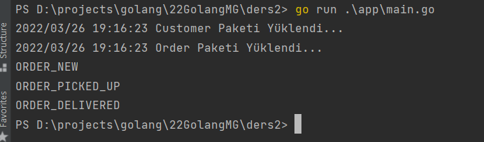
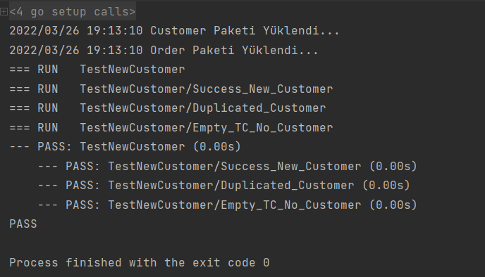

### 1. Hafta ödevi
- domains altında modellerimizi oluşturup gerekli fonksiyonları içerisine ekledik
- app/main.go bizim çalıştırıcı fonksiyonumuzdur

#### Nasıl Çalıştırırız
````
 $ cd app
 $ go run main.go
````

#### Nasıl testleri çalıştırırız.
````
 $ go test ./...
 ````

### Çalıştırma Çıktıları


#### Test Çıktıları
